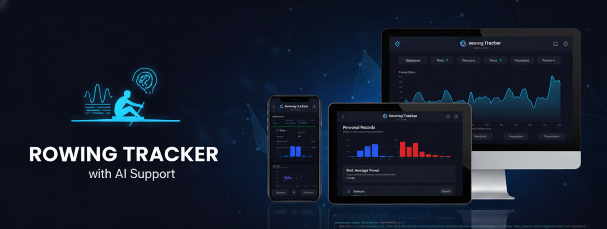

# Rowing Tracker

A stunning web application to visualize SmartRow CSV exports with beautiful analytics, trends, and personal records. This app was completely written by AI.

## Overview

Rowing Tracker is a modern, AI-powered web app built specifically for rowers who use SmartRow equipment. Upload your CSV exports and unlock the power of artificial intelligence to analyze your performance, generate personalized training plans, and receive expert coaching insights—all while maintaining complete privacy with local data storage.

## Features

### 🤖 AI-Powered Intelligence

- **AI Coach with Memory**: Chat with an intelligent rowing coach that remembers your conversation history, analyzes your training data, and references uploaded documents (PDFs, images) to provide personalized advice
- **Tool-Enabled Conversations**: The AI can automatically call tools like `get_sessions`, `get_achievements`, and `get_memory_documents` to fetch your workout history, streak progress, awards, and uploaded PDFs/images without you leaving the chat
- **AI Training Plans**: Generate fully personalized, multi-week training programs based on your fitness level, goals, and rowing history—or choose from proven templates
- **AI Performance Insights**: Receive automated, data-driven insights about your workouts, trends, and areas for improvement directly in your dashboard
- **AI Personal Context**: Write a personal description or select documents from your memory to automatically create a system prompt addition that keeps your health considerations, limitations, and goals in mind across the AI Coach, training plans, and insights
- **Configurable AI System Prompts**: Fine-tune the base system prompt, chat prompt, training plan prompt, and insights prompt from the Settings → Advanced Configuration panel with one-click “reset to default” controls

### 📊 Analytics & Tracking

- **Dashboard**: Comprehensive overview with key metrics, volume charts, and trend analysis
- **Advanced Analytics**: Detailed breakdown of performance, split trends, stroke rate, and training adherence
- **Sessions List**: Browse, filter, and sort all your rowing sessions with advanced search
- **Session Details**: Deep dive into individual workout metrics with interactive charts
- **Stroke-by-Stroke Analysis**: Upload SmartRow stroke exports to unlock power/rhythm distributions, stroke-length consistency, and technique maps for every stroke
- **Personal Records**: Automatic tracking of your best times and performances across all distances

### 💾 Data & Privacy

- **CSV Import**: Simple drag-and-drop upload for SmartRow CSV files
- **Local Storage**: Your data stays private and is stored locally in your browser
- **Memory System**: Upload and store PDFs and images in IndexedDB for AI analysis

### 🎨 User Experience

- **Dark Theme**: Modern, easy-on-the-eyes interface
- **Responsive Design**: Works seamlessly on desktop, tablet, and mobile
- **Offline-First**: All features work offline except AI-powered capabilities

### 🏅 Gamification & Motivation

- **Dynamic Awards System**: Earn achievements for session milestones, total distance, streaks, duration, power output, pace improvements, and more
- **Improvement Awards**: Track percentage gains in power and pace compared to your baseline to unlock higher-tier awards
- **Streak Milestones**: Stay consistent with notifications for 7-, 14-, 21-, 45-, 60-, and 100-day streaks
- **Live Award Notifications**: Celebrate wins instantly with animated overlays whenever you unlock something new

## Tech Stack

- **Framework**: Next.js 15 (App Router)
- **Language**: TypeScript
- **Styling**: TailwindCSS
- **Components**: shadcn/ui
- **Charts**: Recharts
- **AI Integration**: OpenAI API
- **State Management**: Zustand with persist middleware
- **Storage**: 
  - `localStorage` for sessions and settings
  - `IndexedDB` (via idb) for large files and documents
- **CSV Parsing**: papaparse

## Quick Start

### Prerequisites

- Node.js 18+ 
- npm or yarn
- OpenAI API Key (optional, for AI features)

### Installation

1. **Clone the repository**
   ```bash
   git clone https://github.com/rupertgermann/rowing-tracker
   cd rowing-tracker
   ```

2. **Install dependencies**
   ```bash
   npm install
   ```

3. **Run the development server**
   ```bash
   npm run dev
   ```

4. **Open your browser**
   Navigate to [http://localhost:3000](http://localhost:3000)

5. **Configure AI (Optional)**
   - Go to Settings → AI Coach
   - Enter your OpenAI API Key to enable Chat and Training Plans
   - (New) Add your Personal Context to inform the AI about medical conditions, preferences, or goals:
     - Write or paste information directly in the text area
     - Select documents from your memory (PDFs, notes you've uploaded to the AI Coach)
     - Click "Generate AI Context" to condense it into coaching instructions
     - The generated context is automatically injected into all AI features
   - Customize the AI prompts used for chat, insights, and training plans in the Advanced Configuration section (each prompt has a reset-to-default button)

## SmartRow CSV Export Guide

### How to Export Your Data

1. **Connect to SmartRow App**
   - Open the SmartRow mobile app
   - Ensure you're logged in and synced

2. **Export Sessions**
   - Go to Settings/Profile
   - Find "Export Data" or "CSV Export"
   - Select the date range you want to export
   - Choose CSV format
   - Download the file to your device

3. **Upload to Rowing Tracker**
   - Open the Rowing Tracker web app
   - Drag and drop your CSV file or click to browse
   - Wait for processing (typically instant for most files)
   - Your data will be automatically analyzed and stored

### CSV Format Requirements

The app expects SmartRow CSV exports with the following format:
- **Delimiter**: Semicolon (;)
- **Decimal Format**: Comma (,) - European format
- **Timestamp**: YYYY-MM-DD HH:MM:SS.mmm (UTC)
- **Time Field**: Seconds

### Required Columns

Your CSV must include these columns:
- Time stamp (UTC)
- Distance (m)
- Time (seconds)
- Energy (kCal)
- Stroke count (#)
- Average power (W)
- Maximum power (W)
- Average split (s) - per 500m
- Minimum split (s)
- Average stroke rate (SPM)
- Maximum stroke rate (SPM)

## Architecture Overview

```
rowing-tracker/
├── app/                    # Next.js App Router
│   ├── (routes)/          # Route groups
│   │   ├── page.tsx       # Dashboard
│   │   ├── sessions/      # Sessions pages
│   │   ├── prs/           # Personal records
│   │   ├── upload/        # CSV upload
│   │   ├── analytics/     # Advanced analytics
│   │   ├── chat/          # AI Coach chat
│   │   ├── plans/         # Training plans
│   │   └── settings/      # App settings
│   ├── layout.tsx         # Root layout
│   └── globals.css        # Global styles
├── components/            # Reusable UI components
├── lib/                   # Utility functions
│   ├── csvParser.ts       # CSV parsing logic
│   ├── store.ts           # Zustand state management
│   ├── memoryStorage.ts   # IndexedDB storage wrapper
│   ├── cloudAI.ts         # OpenAI integration
│   └── trainingPlans.ts   # Plan generation logic
├── types/                 # TypeScript type definitions
│   └── session.ts         # Session interface
└── docs/                  # Documentation
    ├── prd.md             # Product requirements
    └── design-system.md   # Design guidelines
```

### Data Flow

1. **Upload**: User drops CSV file → papaparse processes → validation
2. **Storage**: 
   - Sessions/Settings → Zustand store → localStorage persistence
   - Documents/Images → MemoryService → IndexedDB
3. **Display**: Components read from store → calculate metrics → render charts
4. **Analysis**: Real-time PR calculations, trend analysis, aggregations
5. **AI Features**: Context retrieved from Store/Memory → sent to OpenAI → response streamed

## Development

### Available Scripts

- `npm run dev` - Start development server
- `npm run build` - Build for production
- `npm run start` - Start production server
- `npm run lint` - Run ESLint

### Project Structure

- **App Router**: Uses Next.js 15's App Router for file-based routing
- **Server Components**: Default for better performance
- **Client Components**: Mark with `'use client'` when needed
- **State Management**: Zustand with localStorage persistence
- **Styling**: TailwindCSS with dark theme support

### Adding Components

```bash
# Add shadcn/ui components
npx shadcn@latest add button card table badge

# Components are added to your components/ directory
```

## Data Model

```typescript
interface Session {
  id: string;
  timestamp: Date;
  distance: number;        // meters
  duration: number;        // seconds
  energy: number;          // kCal
  strokeCount: number;
  avgPower: number;        // watts
  maxPower: number;
  wattPerKg: number;
  avgSplit: number;        // seconds per 500m
  minSplit: number;
  avgWork: number;         // joules
  avgStrokeLength: number; // meters
  avgStrokeRate: number;   // SPM
  maxStrokeRate: number;
}
```

## Privacy & Data

- **Local Storage**: All data is stored locally in your browser
- **No Servers**: No data is sent to external servers
- **Privacy First**: Your workout data remains private
- **Export**: You can export your data at any time (future feature)

## Browser Support

- Chrome 90+
- Firefox 88+
- Safari 14+
- Edge 90+

## Contributing

1. Fork the repository
2. Create a feature branch (`git checkout -b feature/amazing-feature`)
3. Commit your changes (`git commit -m 'Add amazing feature'`)
4. Push to the branch (`git push origin feature/amazing-feature`)
5. Open a Pull Request

## License

This project is licensed under the MIT License - see the [LICENSE](LICENSE) file for details.

## Support

If you encounter any issues:

1. Check that your CSV file matches the required format
2. Ensure all required columns are present
3. Verify your browser supports localStorage
4. Open an issue on GitHub with details about your CSV file and browser

---

**Built with ❤️ for the rowing community**
